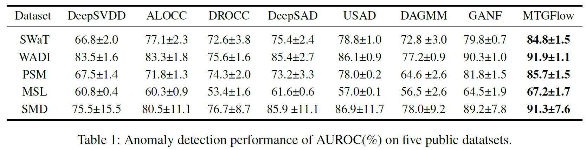

# Detecting Multivariate Time Series Anomalies with Zero Known Label（AAAI 2023）

This repository provides a PyTorch implementation of MTGFlow ([`Paper`](https://arxiv.org/abs/2208.02108)), which is the unsupervised anomaly detection and localization method.
This repository is based on [`GANF`](https://github.com/EnyanDai/GANF).

## Framework


## Main results


## Requirements
* python==3.8.5 
* pytorch==1.7.1
* numpy==1.19.2
* torchvision==1.5
* scipy==1.6.1
* scikit-learn==0.24.1
* scikit-image==0.18.1
* matplotlib== 3.3.4
* pillow == 7.2.0


```sh
pip install -r requirements.txt
```

## Data
We test our method for five public datasets, e.g., ```SWaT```, ```WADI```, ```PSM```, ```MSL```, and ```SMD```.

[`SWaT`](https://itrust.sutd.edu.sg/itrust-labs_datasets/dataset_info/#swat)
[`WADI`](https://itrust.sutd.edu.sg/itrust-labs_datasets/dataset_info/#wadi)

```sh
mkdir Dataset
cd Dataset
mkdir input
```
Download the dataset in ```Data/input```.
## Train
- train for MITGFlow
For example, training for WADI
```sh
sh runners/run_WADI.sh
```
- train for ```DeepSVDD```, ```DeepSAD```, ```DROCC```, and ```ALOCC```. 
```sh
python3 train_other_model.py --name SWaT --model DeepSVDD
```
- train for ```USAD``` and ```DAGMM```
We report the results by the implementations in the following links: 

[`USAD`](https://github.com/manigalati/usad) and [`DAGMM`](https://github.com/danieltan07/dagmm/)


## Test
We provide the pretained model of MTGFlow.

For example, testing for WADI 
```sh
sh runners/run_WADI_test.sh
```
## BibTex Citation

If you find this paper and repository useful, please cite our paper.

```
@inproceedings{zhou2023detecting,
  title={Detecting Multivariate Time Series Anomalies with Zero Known Label},
  author={Zhou, Qihang and Chen, Jiming and Liu, Haoyu and He, Shibo and Meng, Wenchao},
  booktitle={Proceedings of the AAAI Conference on Artificial Intelligence},
  volume={37},
  number={4},
  pages={4963--4971},
  year={2023}
}
```

```
@article{zhou2024label,
  title={Label-Free Multivariate Time Series Anomaly Detection},
  author={Zhou, Qihang and He, Shibo and Liu, Haoyu and Chen, Jiming and Meng, Wenchao},
  journal={IEEE Transactions on Knowledge and Data Engineering},
  year={2024},
  publisher={IEEE}
}
```
